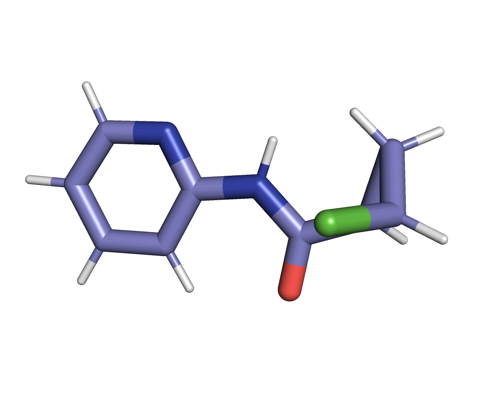

# MACE-OpenMM Hackathon

This repo contains work from the MACE-OpenMM hackathon hosted by the cole-group at the 
University of Newcastle 2022.

This work builds upon the framework laid out by the Chodera lab in the [qmlify](https://github.com/choderalab/qmlify) package and accompanying [paper](https://www.biorxiv.org/content/10.1101/2020.07.29.227959v1).  

## AIMS
- :white_check_mark: Build an [openmm-ml](https://github.com/openmm/openmm-ml) interface for the [MACE](https://github.com/ACEsuit/mace) package add lik to interface here
- :white_check_mark: Run hybrid MM/ML simulations of ligands in complex and solvent add link to the examples here :white_check_mark:
- :white_check_mark: Develop a general interface built on OpenMM tools to calculate MM/ML free energy corrections starting from the output of MM relative binding calculations. Add links to the interface and script to extract data from perses.
- :white_check_mark: Implement a [QCEngine interface](scripts/mace_qcengine.py) to MACE allowing for single point calculations, geometry optimisations and torsiondrives. An example [notebook](examples/mace_qcengine.ipynb) using the interface to perform a geometry optimisation is also included.

A conda [environment](env.yaml) file is also supplied which was used to run the hybrid MM/ML simulations.
This should be used to create the fresh environment using `conda env create -f env.yaml` this following packages should then 
be manually installed
- openmm-ml
- mace
- openmmtools (Dominic's version)

# Authors 
- Kovács Dávid Péter
- Finlay Clark
- Harry Moore
- Mateusz Bieniek
- Josh Horton 
- Daniel Cole 

# Acknowledgements
- Dominic Rufa
- John Chodera